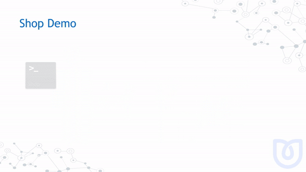

# MassTransit Lightning Talk March 2018

Code from the lightning talk given at [dotnetsheff](https://dotnetsheff) on Tue 6th March 2018.

## Running it

You'll need RabbitMQ running, so docker it:

```
docker run -d -p 15672:15672 -p 5672:5672 rabbitmq:3-management
```

Then run Shop, Payments and Reports projects, `dotnet run` that:

```
dotnet run --project .\src\Shop\Shop.csproj
dotnet run --project .\src\Payments\Payments.csproj
dotnet run --project .\src\Reporting\Reporting.csproj
```

## Overview

This is what is happening




## Notice I can't code?

1. Fork
1. Hack!
1. Pull Request